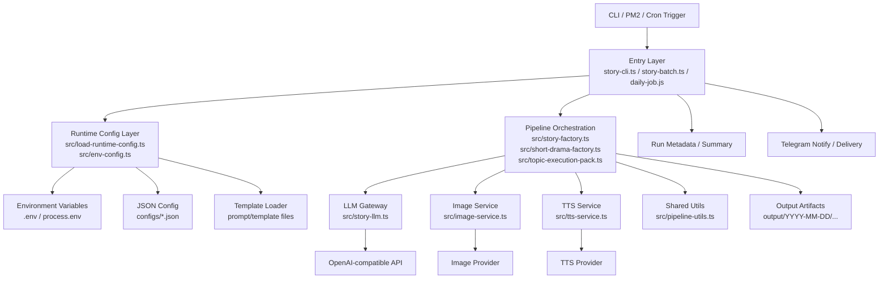
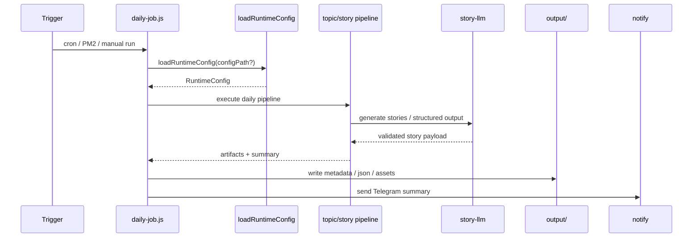
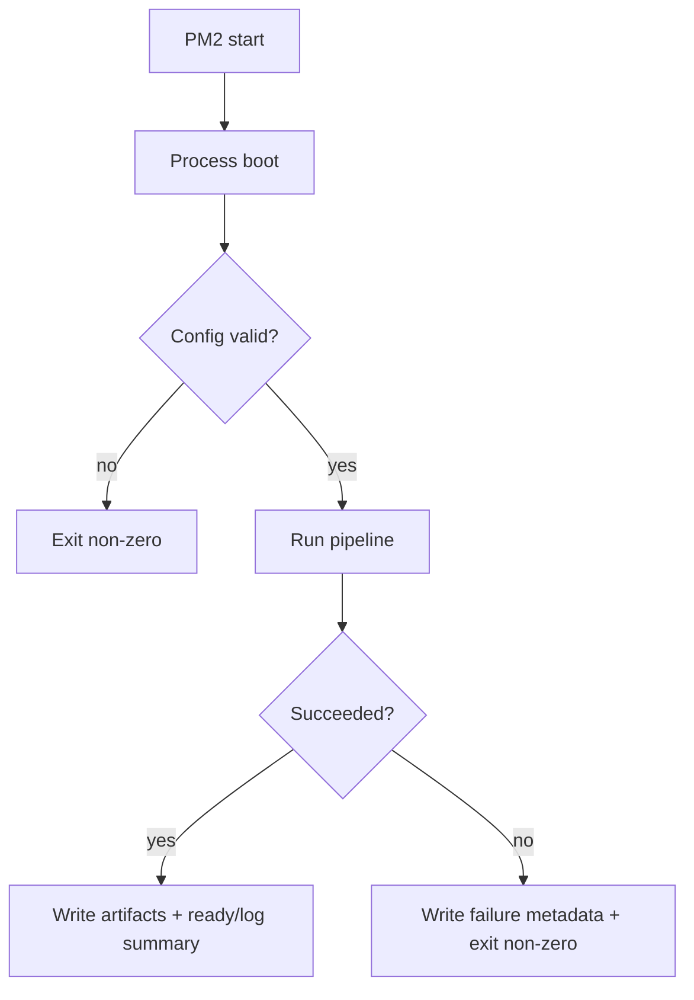
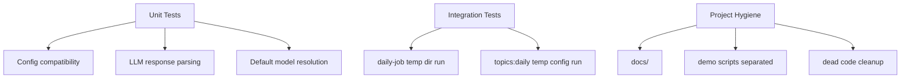
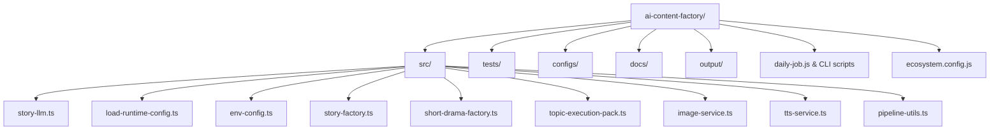

# AI Content Factory 架构图

本文档描述当前项目的核心模块、执行流、配置边界，以及 P0 / P1 / P2 修复后的推荐结构。

## 1. 总体架构

## 2. 分层说明

### 2.1 Entry Layer

入口层负责接收触发并把参数交给 pipeline，不承担业务细节。

主要文件：

- `daily-job.js`
- `story-cli.ts`
- `story-batch.ts`
- `story-weekly.ts`
- `short-drama-cli.ts`

职责：

- 接收 cron / PM2 / 手工命令触发
- 初始化运行参数
- 调用运行时配置加载器
- 调用 story / topic pipeline
- 写出 run metadata、summary、通知结果

### 2.2 Runtime Config Layer

主要文件：

- `src/load-runtime-config.ts`
- `src/env-config.ts`

职责：

- 合并 `process.env`、JSON config、默认值
- 处理 `LLM_API_KEY` / `OPENAI_API_KEY` 等兼容逻辑
- 统一 `OPENAI_BASE_URL` / `LLM_BASE_URL`
- 对 template/config 缺失做安全回退
- 对上层暴露稳定、向后兼容的 `RuntimeConfig`

这层是 **P0 的核心**：

- 避免配置散落在 `daily-job.js`、factory、CLI 各处重复读取
- 避免默认模型名和 baseURL 在不同模块不一致
- 通过兼容字段维持旧调用方不炸

### 2.3 Pipeline Orchestration

主要文件：

- `src/story-factory.ts`
- `src/short-drama-factory.ts`
- `src/topic-execution-pack.ts`

职责：

- 组织 topic -> prompt -> story -> assets 的业务流程
- 控制重试、阶段日志、结果聚合
- 协调 image / tts / llm 等能力

建议：

- orchestration 只负责编排，不直接持有底层 provider 细节
- 所有 provider 细节都通过 service 层封装
- 输出统一结构，便于 `daily-job.js` 汇总与通知

### 2.4 Service Layer

主要文件：

- `src/story-llm.ts`
- `src/image-service.ts`
- `src/tts-service.ts`

职责：

- 跟外部模型或服务交互
- 做请求组装、超时、重试、响应解析
- 返回稳定结构给上层调用

其中 `src/story-llm.ts` 是故事生成核心：

- 统一走 OpenAI-compatible 请求协议
- 负责响应提取和 JSON 结构校验
- 应避免让上层知道 wire protocol 细节

### 2.5 Shared Utilities

主要文件：

- `src/pipeline-utils.ts`
- `src/env-config.ts`（部分通用能力）

职责：

- 通用 retry
- timeout 包装
- 目录创建
- JSON 写入
- 阶段日志

目标：

- 去重
- 让 `daily-job.js` 和工厂层复用同一套基础设施

## 3. 当前推荐执行流

### 3.1 Daily Pipeline

### 3.2 Story Generation Flow

## 4. P0 / P1 / P2 修复说明

## P0：统一入口与配置边界

目标：把“配置读取、默认模型、环境变量兼容、模板回退”统一收口，避免一半在 entry、一半在 service、一半在 test。

已落地方向：

- 使用 `src/env-config.ts` + `src/load-runtime-config.ts` 作为统一配置层
- `daily-job.js` 复用公共能力，而不是自己复制一套配置/重试/写文件逻辑
- 保留兼容导出，避免旧调用方和测试直接炸掉

建议继续遵守：

1. 默认模型来源只能有一个主入口
2. `RuntimeConfig` 对外字段尽量稳定
3. CLI / cron 入口只调用 loader，不直接散读环境变量
4. service 层不要再私自推导另一套默认值

## P1：修正进程编排与运行语义

目标：让 PM2 / cron / daily run 的行为可预测，而不是“看起来在跑，实际上 ready/失败语义混乱”。

建议结构：

关键点：

- `wait_ready` 只在应用真的有 ready 信号时启用
- 若是一次性 job，应该更像 batch worker，而不是长期服务假装 ready
- 失败必须明确退出非 0，便于 PM2/外层监控识别
- retry 只放在外部调用或短暂抖动场景，不要把逻辑错误无限重试

如果 `ecosystem.config.js` 里还把一次性任务当常驻服务配置，建议：

- 拆分 `worker` 和 `scheduler` 角色
- 一次性任务不要求 ready 信号
- 对失败任务设置有限次数 restart，而不是无脑拉起

## P2：测试体系与项目卫生

目标：让改动以后能快速判断有没有破坏主流程，而不是只靠手跑。

建议结构：

建议清单：

- 单测覆盖：
  - 默认模型选择
  - `OPENAI_BASE_URL` / `LLM_BASE_URL` 规范化
  - fenced JSON / raw JSON 解析
  - 兼容字段存在时旧调用方不报错
- 集成测试覆盖：
  - 临时目录运行 `daily-job` 的 dry-run 路径
  - `topics:daily` 的最小闭环
- 工程卫生：
  - demo / experiment 脚本与正式测试分离
  - 无效依赖、死代码、重复工具函数及时清理
  - `docs/` 中维护架构文档和运行说明

## 5. 目录视角

## 6. 后续维护建议

1. 每次改 `RuntimeConfig`，同时跑：
   - `npm run typecheck`
   - `npm test`
2. 每次改 `story-llm.ts`，至少补一条解析/兼容测试。
3. 任何新增入口脚本都不要自己再复制：
   - 配置读取
   - retry
   - JSON 写入
   - output 目录创建
4. `docs/architecture.md` 保持跟真实目录同步；目录变了就更新。

## 7. 一句话总结

这个项目最关键的，不是“再加几个脚本”，而是把 **入口、配置、编排、服务、输出** 五层边界收干净。边界清楚后，daily pipeline 才稳定，测试才好补，后面加渠道或模型也不会继续长成一团。

## Current closure status

The following items are now concretely closed in the repository:

- **P0 / runtime-config unification**: `story-factory`, `short-drama-factory`, and `daily-job` now share the same `loadRuntimeConfig`-driven configuration semantics.
- **P1 / one-shot job semantics**: `daily-job.js` is now a thin launcher for `src/daily-job.ts`, and `ecosystem.config.js` no longer incorrectly requires PM2 ready signals for a batch job.
- **P2 / test matrix and runnable entrypoints**: `npm test` now runs all `tests/*.test.ts`, including runtime config, response parsing, default model, factory runtime, and daily-job dry-run coverage.
