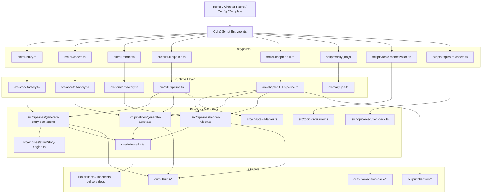

# AI Content Factory Architecture

## Overview

`ai-content-factory` 是一个围绕短视频 / 短剧内容生产的 TypeScript 仓库。

它把内容生产拆成几条可组合的流水线：
- 选题与执行包准备
- 故事包生成
- 图片与音频素材生成
- 视频渲染
- 交付导出
- 日报编排

## System map



## Main flows

### 1. Story pipeline

**Goal:** 从一个 topic 产出结构化故事包。

Path:
- `src/cli/story.ts`
- `src/story-factory.ts`
- `src/pipelines/generate-story-package.ts`
- `src/engines/story/story-engine.ts`

Primary outputs:
- `story-package.json`
- `publish-meta.json`
- `publish-copy.txt`
- `shot-list.md`
- `delivery-checklist.md`

### 2. Assets pipeline

**Goal:** 基于故事包补齐图片与音频素材。

Path:
- `src/cli/assets.ts`
- `src/assets-factory.ts`
- `src/pipelines/generate-assets.ts`
- `src/image-service.ts`
- `src/tts-service.ts`

Primary outputs:
- `images/*`
- `audio/*`
- `asset-manifest.json`

### 3. Render pipeline

**Goal:** 把素材和字幕拼成最终 9:16 视频。

Path:
- `src/cli/render.ts`
- `src/render-factory.ts`
- `src/pipelines/render-video.ts`

Primary outputs:
- `renders/subtitles.srt`
- `render-package.json`
- `render-manifest.json`
- `renders/final.mp4`

### 4. Full pipeline

**Goal:** 通过一个命令串起 story → assets → render。

Path:
- `src/cli/full-pipeline.ts`
- `src/full-pipeline.ts`

### 5. Chapter pipeline

**Goal:** 把章节生产包转成短剧内容产物。

Path:
- `src/cli/chapter.ts`
- `src/cli/chapter-full.ts`
- `src/cli/chapter-batch.ts`
- `src/chapter-adapter.ts`
- `src/chapter-full-pipeline.ts`
- `src/chapter-batch.ts`

### 6. Daily orchestration

**Goal:** 串起选题、执行包和日报产出。

Path:
- `scripts/daily-job.js`
- `src/daily-job.ts`
- `scripts/topic-monetization.ts`
- `scripts/topics-to-assets.ts`
- `scripts/daily-summary.ts`

## Code organization

### Runtime source

- `src/cli/`: 公开 CLI 入口
- `src/core/`: 类型、run context、共享基础设施
- `src/engines/`: 领域引擎
- `src/pipelines/`: 组合式流程
- `src/*.ts`: 当前仍保留在顶层的运行时 façade / service modules

### Non-runtime project files

- `scripts/`: 一次性脚本、日报辅助脚本、手动验证脚本
- `docs/architecture/`: 架构说明
- `docs/operations/`: 运维与工作方式说明
- `docs/project/`: 规划、状态、背景文档
- `tests/`: 自动化测试

## Recommended target tree

```text
ai-content-factory/
├── configs/
├── docs/
│   ├── architecture/
│   ├── operations/
│   └── project/
├── openspec/
├── scripts/
│   ├── manual-tests/
│   └── *.ts
├── src/
│   ├── cli/
│   ├── core/
│   ├── engines/
│   │   └── story/
│   ├── pipelines/
│   └── *.ts
├── tests/
└── output/
```

## Current constraints

- 非 dry-run 的 story/full/daily 路径当前仍依赖 `LLM_API_KEY`，这是运行时配置层的现状，不是 story engine 自身的硬依赖。
- 图片生成依赖 `HF_API_KEY`。
- 默认 TTS 路径使用 Google Translate TTS；VoiceRSS 需要 `VOICERSS_API_KEY`。
- 真正的视频渲染依赖本机 `ffmpeg`。
